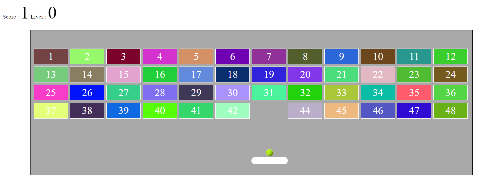

# Bricks Destroyer Game



**Repository:** [Bricks Destroyer Game](https://github.com/PrashantPKP/Bricks-Destroyer-Game.git)

## Description

Bricks Destroyer Game is an engaging, classic arcade-style game where the player controls a paddle to hit a ball and break bricks. The objective is to destroy all the bricks on the screen by bouncing the ball off the paddle, all while avoiding losing the ball.

Players can use the arrow keys to move the paddle left and right, and they must strategize to hit the ball toward the bricks and break them.

## Features

- **Simple and Fun Gameplay:** Destroy bricks by controlling the paddle and bouncing the ball.
- **Interactive Controls:** Use the arrow keys to control the paddle movement.
- **Increasing Difficulty:** The speed of the ball increases as you progress through the game.
- **Score Tracking:** Track how many bricks you have destroyed to challenge your personal best.
- **Responsive Design:** The game is compatible with both desktop and mobile devices.

## How to Play

1. **Move the Paddle:** Use the arrow keys to move the paddle left or right.
2. **Hit the Ball:** The ball will bounce back when it hits the paddle. Use it to break the bricks.
3. **Objective:** Destroy all the bricks on the screen without letting the ball fall below the paddle.

## Demo
[Click here to play the Bricks Destroyer Game!](https://prashantpkp.github.io/Bricks-Destroyer-Game/)

## Installation

Follow these steps to clone and run the game locally:

1. Clone the repository:
   ```bash
   git clone https://github.com/PrashantPKP/Bricks-Destroyer-Game.git

2.Navigate to the project directory:
  ```bash
  cd Bricks-Destroyer-Game
  ```

3.Open the index.html file in your browser to start playing the game!


## Technologies Used

- **HTML5 Canvas** - For rendering the game interface.
- **JavaScript** - To handle the game logic and controls.
- **CSS3** - For styling the game interface.

## Future Improvements

- **Multiple Levels:** Add more levels with increasing difficulty.
- **Power-ups:** Introduce power-ups like speed boost or multi-ball mode.
- **Leaderboards:** Implement a scoring system with global leaderboards.


## Contributing
Contributions are welcome! If you find bugs or have suggestions for new features, feel free to open an issue or submit a pull request. Follow the guidelines below:

1. Fork the repository.
2. Create your feature branch: `git checkout -b feature/your-feature-name`
3. Commit your changes: `git commit -m 'Add some feature'`
4. Push to the branch: `git push origin feature/your-feature-name`
5. Open a pull request.

## License

This project is licensed under the MIT License. See the [LICENSE](LICENSE) file for more details.

## Contact

- **GitHub:** [PrashantPKP](https://github.com/PrashantPKP)

Enjoy the game and happy brick-breaking!

